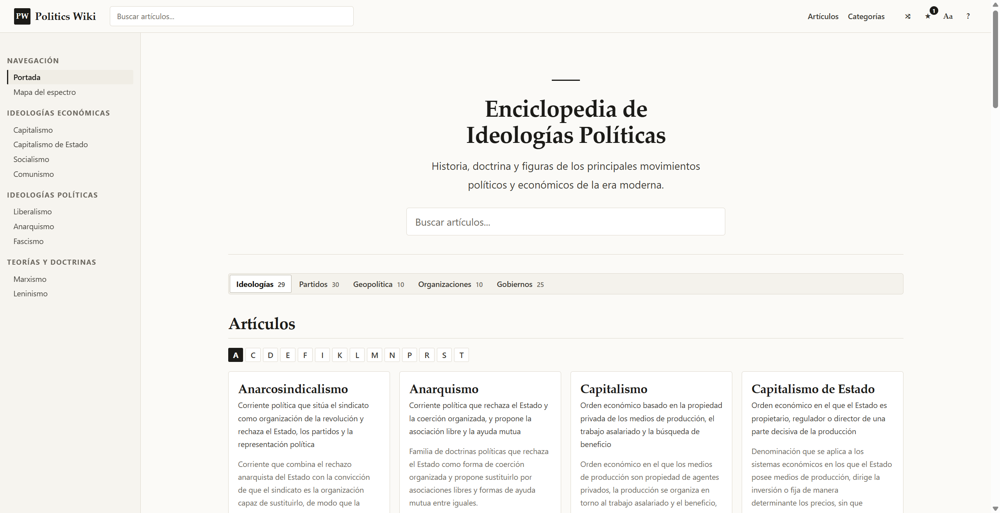
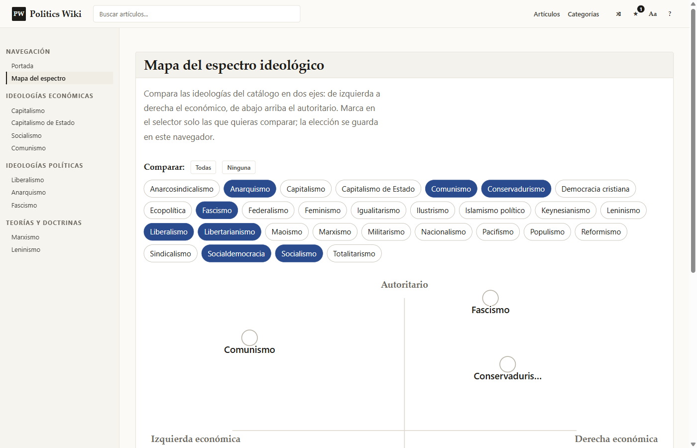

# 🏛️ politics-wiki

Enciclopedia libre y sin servidor sobre **ideologías políticas, partidos, sistemas de gobierno, geopolítica, organizaciones internacionales, pensadores y conceptos**, con formato de enciclopedia, referencias verificables y contenido íntegramente en español.

🌐 **Web en vivo:** https://politics-wiki.pages.dev/


---

## 📖 ¿Qué es?

Un sitio estático con formato de enciclopedia en el que cada tema es una entrada escrita a mano, con secciones estructuradas, referencias comprobables y enlaces cruzados entre temas. El catálogo reúne **108 entradas** repartidas en siete dominios:

| Dominio | Entradas | Contenido | Ejemplos |
|---|---:|---|---|
| 🧭 Ideologías | 29 | Corrientes políticas y económicas | capitalismo, anarquismo, fascismo, liberalismo |
| 🏛️ Partidos | 30 | Partidos de todo el mundo | PSOE, Podemos, Renaissance, Republicanos |
| 🗳️ Gobiernos | 21 | Regímenes y periodos históricos | España, Alemania, Japón, Corea del Norte |
| 🗺️ Geopolítica | 10 | Órdenes, bloques y conflictos | orden multipolar, guerra en Ucrania |
| 🌐 Organizaciones | 10 | Organismos, bloques y tratados | ONU, OTAN, FMI, Unión Europea |
| 📚 Pensadores | 4 | Autores y su legado teórico | Marx, Rawls, Hayek, Arendt |
| 💡 Conceptos | 4 | Nociones políticas fundamentales | soberanía, separación de poderes |

**Sin servidor, sin compilación, sin dependencias, sin CDN:** el sitio funciona abriendo `index.html` directamente desde el disco, bajo `file://`.

---

## ✨ Características

- **Buscador** que cruza los siete dominios al instante, con resaltado de coincidencias.
- **Mapa del espectro ideológico** interactivo en su propia página: 29 ideologías con coordenadas editoriales sobre los ejes económico y autoritario, un selector para elegir cuáles comparar (o «Todas») y selección recordada entre sesiones.
- **Grafo de conexiones** en cada artículo: el tema central junto a sus vecinos relacionados, navegable.
- **Wikilinks** entre dominios con desambiguación por prefijo (`[[partido:ppsoe]]`) y anclas de sección (`[[gob:espana#gc-golpe-de-estado|la guerra civil]]`).
- **Preferencias de lectura** — tema (claro, oscuro, sepia, automático), tamaño de texto y ancho de columna — aplicadas *antes* del primer pintado: **sin destello al recargar**.
- **Favoritos** por dominio, **índice alfabético**, **progreso de lectura**, **entrada aleatoria** y **tarjetas de vista previa** al pasar el ratón sobre un enlace.
- **Atajos de teclado** con panel de ayuda: `/` buscar, `r` aleatorio, `f` favorito, `p` preferencias, `t` arriba, `?` ayuda, `Esc` cerrar.
- **Accesible**: navegación por teclado en toda la interfaz, estados `aria-*`, contraste AA en los cuatro temas y respeto por `prefers-reduced-motion`.
- **Sin rastreadores ni cookies**: sin analítica, sin fuentes remotas y sin peticiones de terceros. El tema y los favoritos se guardan solo en el navegador.
- **Instalable y disponible sin red**: manifiesto web y service worker con precaché de todo el catálogo.

## 🖼️ Capturas

**Portada** — catálogo por dominios con buscador, índice alfabético y conmutador de dominio:



**Mapa del espectro ideológico** — selector de ideologías y mapa sobre los ejes económico y autoritario:



---

## 🚀 Empezar

```bash
# Opción A (recomendada para desarrollo): servidor estático sin dependencias
node serve.js                # → http://localhost:4321

# Opción B: abrir directamente el archivo, sin servidor
start index.html
```

> El sitio está diseñado para funcionar bajo `file://`, así que si algo solo
> funciona con servidor, es un defecto.

No hay nada que instalar: `package.json` no declara dependencias.

### Páginas

| URL | Qué es |
|---|---|
| `index.html` | Portada: catálogo agrupado por dominio, con conmutador entre los siete |
| `index.html?tipo=partido` | Catálogo de partidos, agrupado por país |
| `article.html?title=capitalismo` | Ficha de una ideología |
| `article.html?tipo=partido&title=ppsoe` | Ficha de un partido |
| `espectro.html` | Mapa del espectro ideológico con selector |
| `about.html` | Acerca de la enciclopedia y aviso legal |
| `404.html` | Página de «no encontrado» |

---

## 🧱 Tecnología

- **Cero dependencias**: HTML, CSS y JavaScript clásico. Sin frameworks, sin módulos ES, sin `fetch`, sin librerías remotas.
- **Una hoja de estilos** (`css/wiki.css`) con un design system propio de tokens CSS (`--pw-*`) que re-tematiza todo el sitio en cuatro modos.
- **Un único global** (`window.PW`): cada entrada es una IIFE que se auto-registra y el motor la renderiza.
- **Service worker** (`sw.js`) con precaché del catálogo para navegación sin conexión.
- **Cabeceras de seguridad** (`_headers`) con una CSP estricta sin `unsafe-inline` ni `unsafe-eval`.
- `serve.js`: servidor estático opcional de unas 100 líneas con el módulo `http` de Node (solo para desarrollo).

## 📁 Estructura

```
politics-wiki/
├── index.html          Portada y catálogo, con conmutador de dominio
├── article.html        Ficha de una entrada
├── espectro.html       Mapa del espectro ideológico
├── about.html          Acerca de y aviso legal
├── 404.html            Página de error
├── css/wiki.css        Design system completo, única hoja de estilos
├── js/
│   ├── data/           Entradas por dominio (un <script> por entrada)
│   ├── render.js       Registro, catálogo, fichas y marcado en línea
│   ├── search.js       Buscador, cruza los siete dominios
│   ├── app.js          Router y arranque
│   ├── spectrum.js     Mapa del espectro interactivo
│   ├── graph.js        Grafo de conexiones de cada artículo
│   ├── interactions.js Capa de interacción y transiciones
│   ├── motion.js       Utilidades de movimiento y revelado
│   └── features.js     Capa de interfaz (siempre el último script)
├── tools/              Batería de validación (7 herramientas, sin deps)
├── sw.js               Service worker y precaché
├── sitemap.xml         Mapa del sitio
└── serve.js            Servidor estático de desarrollo
```

## ✅ Validación

El repositorio incluye **siete validadores** en `tools/`, también sin dependencias: esquema y secciones por dominio, integridad de wikilinks, aserciones del motor, contrato de campos, limpieza de prosa, registro de scripts en el HTML y barrido del patrón de inicialización.

```bash
node tools/pwcheck3.js      # esquema, secciones, enlaces, registro HTML
node tools/pwengine3.js     # aserciones del motor
node tools/pwengine4.js     # aserciones de contrato por dominio
node tools/audit-prose.js   # prosa limpia y sin contaminación
node tools/contamscan.js    # caracteres fuera del rango latino
node tools/linkcheck.js     # related y wikilinks contra entradas reales
node tools/pwsweep.js       # patrón de registro de cada fichero de datos
```

**Estado actual:** `DEFINITIVO: 0 defectos en los 108 registros` · `272/0` · `2529/0/0` · `108/108` · `0` · `0 referencias rotas` · `79/0`.

---

## 📚 Documentación técnica

- **`DEVELOPMENT.md`** — guía de desarrollo: arquitectura, dominios, URLs, orden de carga de scripts, cómo añadir una entrada y validación.
- **`CONTRACT.md`** — contrato de contenido: esquema de artículo, tipos de bloque, marcado en línea y clases CSS.
- **`CONTRACT-V3.md`** — esquema y reglas de partidos, gobiernos, geopolítica, organizaciones, pensadores y conceptos.

## 🤝 Contribuir

1. Leer primero `DEVELOPMENT.md`: la regla de oro es **sin compilación y sin depender de la red**.
2. Añadir o editar una entrada siguiendo el esquema de su dominio y registrar su `<script>` en las dos páginas HTML.
3. Ejecutar la batería de `tools/` hasta que `pwcheck3` informe de **0 defectos**.
4. Para erratas o dudas, abrir una incidencia en este repositorio.

## 📄 Licencia

- **Contenido** (textos de las entradas): [CC BY-SA 4.0](https://creativecommons.org/licenses/by-sa/4.0/).
- **Código** (HTML, CSS, JS y herramientas): [MIT](LICENSE).

> El contenido es informativo y divulgativo. No constituye asesoramiento político,
> económico, financiero ni legal.
